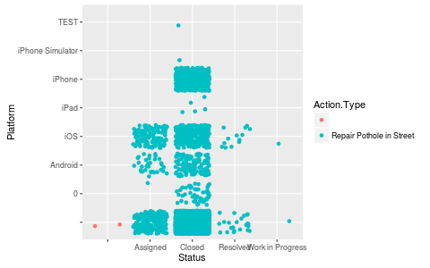
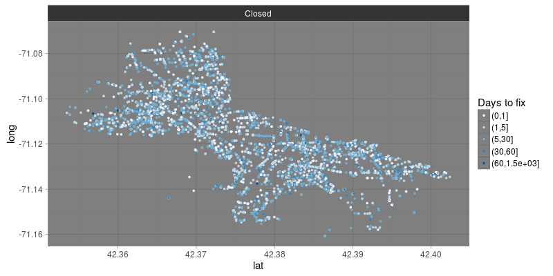

# POLYGLOT DATA ANALYSIS VISUALLY DEMONSTRATED WITH PYTHON AND R
## Jupyter Days Boston - 2016
### (Laurent Gautier)

## R "magic"

- extension to the jupyter notebook
- defines "magic": `%%R` and `%R`

<dl>
<dt>In [1]:</dt>
<dd>
<pre><code data-trim>
%load_ext rpy2.ipython
</code></pre>
</dd>
</dl>

---

- R code can be mixed with Python code
- Cells with R code are prefixed with `%%R`
- The R output is returned

<dl>
<dt>In [2]:</dt>
<dd>
<pre><code data-trim>
%%R

R.version

</code></pre>
</dd>
</dl>

                   _                                          
    platform       x86_64-pc-linux-gnu                        
    arch           x86_64                                     
    os             linux-gnu                                  
    system         x86_64, linux-gnu                          
    status         Patched                                    
    major          3                                          
    minor          2.3                                        
    year           2015                                       
    month          12                                         
    day            22                                         
    svn rev        69809                                      
    language       R                                          
    version.string R version 3.2.3 Patched (2015-12-22 r69809)
    nickname       Wooden Christmas-Tree                      

---

<dl>
<dt>In [3]:</dt>
<dd>
<pre><code data-trim>
%%R
## Dobson (1990) Page 93: Randomized Controlled Trial :
counts <- c(18,17,15,20,10,20,25,13,12)
outcome <- gl(3,1,9)
treatment <- gl(3,3)
print(d.AD <- data.frame(treatment, outcome, counts))
glm.D93 <- glm(counts ~ outcome + treatment, family = poisson())
anova(glm.D93)
</code></pre>
</dd>
</dl>

      treatment outcome counts
    1         1       1     18
    2         1       2     17
    3         1       3     15
    4         2       1     20
    5         2       2     10
    6         2       3     20
    7         3       1     25
    8         3       2     13
    9         3       3     12
    Analysis of Deviance Table
    
    Model: poisson, link: log
    
    Response: counts
    
    Terms added sequentially (first to last)
    
    
              Df Deviance Resid. Df Resid. Dev
    NULL                          8    10.5814
    outcome    2   5.4523         6     5.1291
    treatment  2   0.0000         4     5.1291

---

### Communicating with the outside world (Python)

<dl>
<dt>In [4]:</dt>
<dd>
<pre><code data-trim>
FILENAME = "Pothole_Repair_Requests.csv"
</code></pre>
</dd>
</dl>

<dl>
<dt>In [5]:</dt>
<dd>
<pre><code data-trim>
%%R -i FILENAME
print(FILENAME)
</code></pre>
</dd>
</dl>

    [1] "Pothole_Repair_Requests.csv"

<dl>
<dt>In [6]:</dt>
<dd>
<pre><code data-trim>
%%R -o result
result <- 2*pi
</code></pre>
</dd>
</dl>

---

# Data table

- Running code in 2 languages is nice...
- ...but code objects should be passed back and forth
- The "data table" is:
  * a high-level data structure
  * common (in concept) across Python, R (and SQL, etc...)

---

## Reading from a CSV file

### Pandas

<dl>
<dt>In [7]:</dt>
<dd>
<pre><code data-trim>
# FILENAME = "Pothole_Repair_Requests.csv"
import pandas
pdataf = pandas.read_csv(FILENAME)
</code></pre>
</dd>
</dl>

---

### R "magic"

<dl>
<dt>In [8]:</dt>
<dd>
<pre><code data-trim>
%%R -i FILENAME
dataf <- read.csv(FILENAME)
str(dataf)
</code></pre>
</dd>
</dl>

    'data.frame':	6161 obs. of  8 variables:
     $ Request.ID    : Factor w/ 6160 levels "","REQ194189",..: 2 3 4 5 6 7 8 9 10 11 ...
     $ Status        : Factor w/ 5 levels "","Assigned",..: 3 3 3 3 3 3 3 3 3 3 ...
     $ Action.Type   : Factor w/ 2 levels "","Repair Pothole in Street": 2 2 2 2 2 2 2 2 2 2 ...
     $ Date.Submitted: Factor w/ 2670 levels "","01/01/2013 12:00:00 AM",..: 69 69 69 69 69 69 69 69 81 81 ...
     $ Date.Completed: Factor w/ 1922 levels "","01/02/2012 12:00:00 AM",..: 55 55 55 55 55 55 55 55 74 74 ...
     $ Address       : Factor w/ 3558 levels "","1 Aberdeen Ave\nCambridge, MA\n(42.37734449700048, -71.14744958699964)",..: 3154 3500 3094 3448 2247 3398 2571 3451 3197 3400 ...
     $ Platform      : Factor w/ 8 levels "","0","Android",..: 1 1 1 1 1 1 1 1 1 1 ...
     $ Submitted.By  : Factor w/ 48 levels "","anagle","apedro",..: 7 7 7 7 7 7 7 7 7 7 ...

R has namespaces:

<dl>
<dt>In [9]:</dt>
<dd>
<pre><code data-trim>
%%R -i FILENAME
dataf <- utils::read.csv(FILENAME)
str(dataf)
</code></pre>
</dd>
</dl>

    'data.frame':	6161 obs. of  8 variables:
     $ Request.ID    : Factor w/ 6160 levels "","REQ194189",..: 2 3 4 5 6 7 8 9 10 11 ...
     $ Status        : Factor w/ 5 levels "","Assigned",..: 3 3 3 3 3 3 3 3 3 3 ...
     $ Action.Type   : Factor w/ 2 levels "","Repair Pothole in Street": 2 2 2 2 2 2 2 2 2 2 ...
     $ Date.Submitted: Factor w/ 2670 levels "","01/01/2013 12:00:00 AM",..: 69 69 69 69 69 69 69 69 81 81 ...
     $ Date.Completed: Factor w/ 1922 levels "","01/02/2012 12:00:00 AM",..: 55 55 55 55 55 55 55 55 74 74 ...
     $ Address       : Factor w/ 3558 levels "","1 Aberdeen Ave\nCambridge, MA\n(42.37734449700048, -71.14744958699964)",..: 3154 3500 3094 3448 2247 3398 2571 3451 3197 3400 ...
     $ Platform      : Factor w/ 8 levels "","0","Android",..: 1 1 1 1 1 1 1 1 1 1 ...
     $ Submitted.By  : Factor w/ 48 levels "","anagle","apedro",..: 7 7 7 7 7 7 7 7 7 7 ...

---

### R from Python

#### R packages in Python namespaces

<dl>
<dt>In [10]:</dt>
<dd>
<pre><code data-trim>
from rpy2.robjects.packages import importr
utils = importr('utils')
</code></pre>
</dd>
</dl>

The Python object "`utils`" is a namespace.

Write `utils.` in a cell and hit <kbd>tab</kbd>.

---

<dl>
<dt>In [11]:</dt>
<dd>
<pre><code data-trim>
dataf = utils.read_csv(FILENAME)
</code></pre>
</dd>
</dl>

<dl>
<dt>In [12]:</dt>
<dd>
<pre><code data-trim>
print(dataf.colnames)
</code></pre>
</dd>
</dl>

    [1] "Request.ID"     "Status"         "Action.Type"    "Date.Submitted"
    [5] "Date.Completed" "Address"        "Platform"       "Submitted.By"  
    

---

# GGplot2 graphics

Build graphics with
- "mappings": associate "columns" with visual dimensions
- "layers"  : additive declarations to build a figure

<dl>
<dt>In [13]:</dt>
<dd>
<pre><code data-trim>
%%R
# makes graphics prettier on my Linux system.
default_bitmapType <- getOption("bitmapType")
options(bitmapType="cairo")
# if issues with graphics, revert with
# options(bitmapType=default_bitmapType)
</code></pre>
</dd>
</dl>

---

### First in R:

Map the column `Status` to the visual dimension `x`.

<dl>
<dt>In [14]:</dt>
<dd>
<pre><code data-trim>
%%R -i dataf -h 300
#The height of the figure is specified with "-h 300"
library(ggplot2)

p = ggplot(dataf) +
    geom_bar(aes(x=Status))
print(p)
</code></pre>
</dd>
</dl>

---

### Map:
- column `Status` to visual dimension `x`.
- column `Platform` to visual dimension `y`.

<dl>
<dt>In [15]:</dt>
<dd>
<pre><code data-trim>
%%R -i dataf -h 300
p = ggplot(dataf) +
    geom_jitter(aes(x=Status, y=Platform))
print(p)
</code></pre>
</dd>
</dl>

---

### Map:
- column `Status` to visual dimension `x`.
- column `Platform` to visual dimension `y`.
- column `Action.Type` to visual dimension `color`.

<dl>
<dt>In [16]:</dt>
<dd>
<pre><code data-trim>
%%R -i dataf -h 300
p = ggplot(dataf) +
    geom_jitter(aes(x=Status, y=Platform, color=Action.Type))
print(p)
</code></pre>
</dd>
</dl>

---

## Interlude: namespaces in R

<dl>
<dt>In [17]:</dt>
<dd>
<pre><code data-trim>
%%R -i dataf -h 300
library(ggplot2)

p = ggplot2::ggplot(dataf) +
    ggplot2::geom_bar(ggplot2::aes(x=Status))
print(p)
</code></pre>
</dd>
</dl>

---

## R from Python

<dl>
<dt>In [18]:</dt>
<dd>
<pre><code data-trim>
%%R
p = ggplot2::ggplot(dataf) +
    ggplot2::geom_bar(ggplot2::aes(x=Status))
</code></pre>
</dd>
</dl>

<dl>
<dt>In [19]:</dt>
<dd>
<pre><code data-trim>
from rpy2.robjects.lib import ggplot2
import rpy2.ipython.ggplot as igp
</code></pre>
</dd>
</dl>

<dl>
<dt>In [20]:</dt>
<dd>
<pre><code data-trim>
gp = ggplot2
p = (gp.ggplot(dataf) +
     gp.geom_bar(gp.aes_string(x='Status')))
type(p)
</code></pre>
</dd>
</dl>

    rpy2.robjects.lib.ggplot2.GGPlot

---

<dl>
<dt>In [21]:</dt>
<dd>
<pre><code data-trim>
from rpy2.ipython.ggplot import display_png
# register display func with PNG formatter:
png_formatter = get_ipython().display_formatter.formatters['image/png']
dpi = png_formatter.for_type(ggplot2.GGPlot, display_png)
</code></pre>
</dd>
</dl>

---

<dl>
<dt>In [22]:</dt>
<dd>
<pre><code data-trim>
p
</code></pre>
</dd>
</dl>

---

<dl>
<dt>In [23]:</dt>
<dd>
<pre><code data-trim>
p + gp.theme_gray(base_size=20)
</code></pre>
</dd>
</dl>

---

<dl>
<dt>In [24]:</dt>
<dd>
<pre><code data-trim>
p = (gp.ggplot(dataf) +
     gp.geom_bar(gp.aes_string(x='Platform')) +
     gp.theme_gray(base_size=20))
p
</code></pre>
</dd>
</dl>

---

<dl>
<dt>In [25]:</dt>
<dd>
<pre><code data-trim>
p = (gp.ggplot(dataf) +
     gp.geom_bar(gp.aes_string(x='Platform')) +
     gp.facet_grid('~Status') +
     gp.theme_gray(base_size=20) +
     gp.theme(**{'axis.text.x': gp.element_text(angle = 90, hjust = 1)}))
p
</code></pre>
</dd>
</dl>

---

<dl>
<dt>In [26]:</dt>
<dd>
<pre><code data-trim>
p + gp.scale_y_sqrt()
</code></pre>
</dd>
</dl>

---

# dplyr

- mutate
- filter
- group_by # compute weekly statistics
- summarize

---

<dl>
<dt>In [27]:</dt>
<dd>
<pre><code data-trim>
next(dataf[5].iter_labels())
</code></pre>
</dd>
</dl>

    'Concord Ave\nCambridge, MA\n(42.38675507400046, -71.14068255199965)'

---

<dl>
<dt>In [28]:</dt>
<dd>
<pre><code data-trim>
from rpy2.robjects.lib import dplyr
</code></pre>
</dd>
</dl>

---

<dl>
<dt>In [29]:</dt>
<dd>
<pre><code data-trim>
ddataf = dplyr.DataFrame(dataf)
</code></pre>
</dd>
</dl>

---

<dl>
<dt>In [30]:</dt>
<dd>
<pre><code data-trim>
import re
s_pat_float = '[+-]?[0-9.]+'
s_pat_coords = '.+\((%s), (%s)\)$' % (s_pat_float, s_pat_float)
pat_coords = re.compile(s_pat_coords,
                        flags=re.DOTALL)
from rpy2.robjects import NA_Real
def extract_coords(address):
    m = pat_coords.match(address)
    if m is None:
        return (NA_Real, NA_Real)
    else:
        return tuple(float(x) for x in m.groups())
</code></pre>
</dd>
</dl>

---

<dl>
<dt>In [31]:</dt>
<dd>
<pre><code data-trim>
extract_coords(next(ddataf[5].iter_labels()))
</code></pre>
</dd>
</dl>

    (42.38675507400046, -71.14068255199965)

---

<dl>
<dt>In [32]:</dt>
<dd>
<pre><code data-trim>
from rpy2.robjects.vectors import FloatVector
from rpy2.robjects import globalenv

globalenv['extract_lat'] = \
    lambda v: FloatVector(tuple(extract_coords(x)[0] for x in v))

globalenv['extract_long'] = \
    lambda v: FloatVector(tuple(extract_coords(x)[1] for x in v))

ddataf = (ddataf.
          mutate(lat='extract_lat(as.character(Address))',
                 long='extract_long(as.character(Address))',
                 date_submitted='as.POSIXct(Date.Submitted, format="%m/%d/%Y %H:%M:%S")',
                 date_completed='as.POSIXct(Date.Completed, format="%m/%d/%Y %H:%M:%S")').
          mutate(days_to_fix='as.numeric(date_completed - date_submitted, unit="days")'))
</code></pre>
</dd>
</dl>

---

<dl>
<dt>In [33]:</dt>
<dd>
<pre><code data-trim>
p = (gp.ggplot(ddataf) +
     gp.geom_hex(gp.aes_string(x='lat', y='long'), bins=50) +
     gp.scale_fill_continuous(trans="sqrt") +
     gp.theme_gray(base_size=15) +
     gp.facet_grid('~Status'))
p
</code></pre>
</dd>
</dl>

---

<dl>
<dt>In [34]:</dt>
<dd>
<pre><code data-trim>
p = (gp.ggplot(ddataf.filter('Status == "Closed"')) +
     gp.geom_density(gp.aes_string(x='days_to_fix')) +
     gp.facet_grid('~Status') +
     gp.scale_x_sqrt() +
     gp.theme_gray(base_size=15) +
     gp.theme(**{'legend.position': 'top'}))
p
</code></pre>
</dd>
</dl>

---

<dl>
<dt>In [35]:</dt>
<dd>
<pre><code data-trim>
p = (gp.ggplot(ddataf.filter('Status == "Closed"',
                             'days_to_fix < 100')) +
     gp.geom_histogram(gp.aes_string(x='days_to_fix'), bins=100) +
     gp.facet_grid('~Status') +
     gp.theme_gray(base_size=15) +
     gp.theme(**{'legend.position': 'top'}))
p
</code></pre>
</dd>
</dl>

---

<dl>
<dt>In [36]:</dt>
<dd>
<pre><code data-trim>
dtf_grp_r = 'cut(days_to_fix, c(0,1,5,30,60,1500))'
p = (gp.ggplot(ddataf.filter('Status == "Closed"')) +
     gp.geom_point(gp.aes_string(x='lat', y='long',
                                 color=dtf_grp_r),
                  size=1) +
     gp.facet_grid('~Status') +
     gp.theme_dark(base_size=15) +
     gp.scale_color_brewer("Days to fix"))
p
</code></pre>
</dd>
</dl>

---

<dl>
<dt>In [37]:</dt>
<dd>
<pre><code data-trim>
p = (gp.ggplot(ddataf.filter('Status == "Closed"')) +
     gp.geom_histogram(gp.aes_string(x='date_completed'), bins=30) +
     gp.facet_grid('~Status') +
     gp.theme_gray(base_size=15) +
     gp.theme(**{'legend.position': 'top'}))
p
</code></pre>
</dd>
</dl>

---

<dl>
<dt>In [38]:</dt>
<dd>
<pre><code data-trim>
p = (gp.ggplot(ddataf.filter('Status %in% c("Closed", "Resolved")')) +
     gp.geom_hex(gp.aes_string(x='date_submitted', y='date_completed')) +
     gp.facet_grid('~Status') +
     gp.scale_fill_continuous(trans="log") +
     gp.theme(**{'legend.position': 'top',
                 'axis.text.x': gp.element_text(angle = 45, hjust = .5)}))
p
</code></pre>
</dd>
</dl>

---

<dl>
<dt>In [39]:</dt>
<dd>
<pre><code data-trim>
extract_weekday = """
factor(weekdays(date_submitted),
       levels=c("Sunday", "Monday",
                "Tuesday", "Wednesday", "Thursday",
                "Friday", "Saturday"))
"""
# transition iPhone / iOS
ddataf = (ddataf.
          mutate(year_submitted='format(date_submitted, format="%Y")',
                 month_submitted='format(date_submitted, format="%m")',
                 weeknum_submitted='as.numeric( format(date_submitted+3, "%U"))',
                 weekday_submitted=(extract_weekday)).
	  filter('year_submitted >= 2012',
                 'Platform != ""'))
</code></pre>
</dd>
</dl>

---

<dl>
<dt>In [40]:</dt>
<dd>
<pre><code data-trim>
from IPython.core import display
p = (gp.ggplot(ddataf) +
     gp.geom_bar(gp.aes_string(x='(weekday_submitted)', fill='Platform')) +
     gp.scale_fill_brewer(palette = 'Set1') +
     gp.scale_y_sqrt() +
     gp.theme(**{'axis.text.x': gp.element_text(angle = 90, hjust = 1)}) +
     gp.facet_grid('month_submitted ~ year_submitted'))
display.Image(display_png(p, height=700))
</code></pre>
</dd>
</dl>

